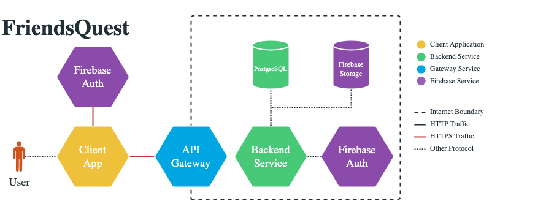
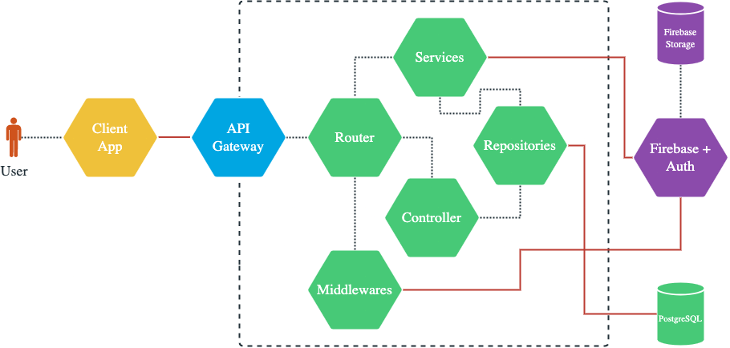
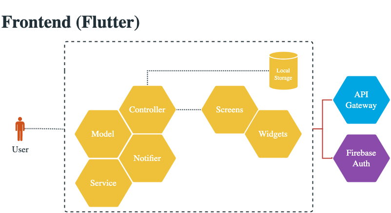

# FriendsQuest API
 
A Node.js express application written in Typescript for the backend of the App "FriendsQuest".

## Requirements
* docker
* node ^16.17
* npm ^8

optional:
* nvm

## Important notes

This is necessary for the typescript compiler:
* Always write `/index.js` at the end of the import path if you reference an index.ts file.
* Keep in mind to use `.js` for file extension. If you omit the extension, the application won't work because Typescript is used.
    - `import { User } from './user/index.js';`: ☑️
    - `import { User } from './user/index';`: ❌
    - `import { User } from './user';`: ❌
    - `import { User } from './user.js';`: ❌
    - `import { User } from './user.ts';`: ❌
## Getting started

You have two options: using the backend within or outside a docker container.

Hot reloading of the Node.js app is always turned on for `npm run start`.

### Setting up the .env file

```bash 
# copy env file
$ cp .env.dist .env
# of course you have to change some values in the .env file (there's a comment in the file)
# you can finde the values in our teams channel in the section OneNote
```

### Running with node in docker

```bash
# installing pre-commit hooks
$ npm install

# if running for the first time
$ docker-compose up --build

# afterwards
$ docker-compose up
```

Keep in mind that you have to rebuild the container when installing new dependencies.

### Running without node in docker
```bash
# if running for the first time
$ docker-compose up --build api

# afterwards
$ docker-compose up api

# second terminal
$ npm install
$ npm run dev
```

## Pre-commit hook with [Husky](https://github.com/typicode/husky) and [lint-staged](https://github.com/okonet/lint-staged)
Read carefully: it's pre-commit and not pre-push. See the difference in the official [git book](https://git-scm.com/book/en/v2/Customizing-Git-Git-Hooks).
Because only well-formatted and standards-compliant code should be included in the repo,
we decided to format all edited files and check them using the linters.
If one linter finds any issue and isn't able to fix it by itself, you aren't able to commit your changes.
Take a look at the output of the linter(s) and fix the issue(s), so you can commit your changes.
If you want to check if your code is well-formatted and standards-compliant, you can manually run the scripts mentioned in the chapters below.

## Linter

### ESLint

ESLint is a tool for identifying and reporting on patterns found in ECMAScript/JavaScript code.
Check out the [ESLint repo](https://github.com/eslint/eslint) for detailed explanations.

We take advantage of different packages to define our rules. Further information can be found in the `.eslintrc.cjs`.

### Usage

#### IDE / Code Editor

Be sure to enable ESLint in your preferences to get realtime feedback.

#### Identify wrong patterns

``` bash
# run ESLint
$ npm run lint
```

#### Let the linter(s) fix your problems

``` bash
# automatically fix all ESLint issues
$ npm run lintfix
```

## Mikro-ORM

We access our PostgreSQL-Database through the ORM-Tool [Mikro ORM](https://mikro-orm.io/). Keep in mind your api docker container needs to run in order to access the local database.

### Migrations and Entities

Migrations are shipped by Mikro ORM. They are created automatically. Mikro ORM looks into the [entities](./src/entities) directory to create the migrations.

#### Creating a Migration

```bash
$ npm run migrate:create
```

#### Applying Migrations

```bash
# Migrate up to the latest version
$ npm run migrate:up
```

#### Reverse Migrations

```bash
# Migrate one step down
$ npm run migrate:down
```

#### Start new
```bash
# Drop the database and migrate up to the latest version
$ npm run migrate:fresh
```

### Seeders

You can create dummy data with Seeders. To create a new Seeder use `npm run seeder:create -- <EntityName>`. To run it: `npm run seeder:run`.

#### Fresh seeding
```bash
# Drop the database, migrate up to the latest version and afterwards seed the database
$ npm run orm:restart
```

## Architecture and Folder Structure

### General architecture


### Backend architecture


### Frontend architecture


### Logical business units

The app is divided into different logical business units. Each business unit has its own file/sub-folder in the following folders ([controller](#controllers), [repositories](#repositories), [router](#router)). The business units are:

* Footprint
* Friendship
* Leaderboard
* User

### Admin

The [admin](./src/admin) folder contains the admin panel of the backend. The admin panel is used to manage the database and make use of the interactive swagger documentation. The admin panel is not a real part of the app. It's password protected and only accessible for the developers.

### Config

Within the [config](./src/config) folder you can find the configuration files for the app.

### Constants

The [constants](./src/constants) folder contains all constants used in the app. For better readability, the constants are divided into different files:

* General constants are stored in [index.ts](./src/constants/index.ts).
* Constants related to the point system are stored in the [points.ts](./src/constants/points.ts) file.

### Controllers

The [controllers](./src/controllers) folder contains all controllers. The controllers are used to handle the business logic. They are the connecting component between the routers and the repositories.

### Docs

The [docs](./src/docs) folder contains parts of our swagger documentation.

We use `jsdocs` to write Open API compliant documentation within js comments. Reusable components are managed as .yaml files in this folder.

Moreover, the general swagger configuration is stored in [swagger.ts](./src/docs/swagger.ts).

### Entities

The [entities](./src/entities) folder contains all entities. The entities are used to define the database structure and is used my `mikro-orm` to create migrations ([see](#migrations-and-entities)).

### Errors

The [errors](./src/errors) folder contains all custom errors. The custom errors are used to handle errors in a more structured way.

We use the RFC 7807 standard to define our errors. The errors are divided into different files.

A general helper for correct data mapping to comply with the RFC 7807 standard is stored in [ProblemDocument.ts](./src/errors/ProblemDocument.ts).

### Helper

The [helper](./src/helper) folder contains all helper functions. The helper functions are used to handle (common) tasks in a more structured way.

### Middlewares

The [middlewares](./src/middlewares) folder contains all middlewares. The middlewares are used to handle requests and check the following things before the request is handled by the controller:

* Check if request is valid ([errorHandler.ts](./src/middlewares/errorHandler.ts))
* Check if the user is authenticated ([firebaseAuth.ts](./src/middlewares/firebaseAuth.ts))

### Migrations

The [migrations](./src/migrations) folder contains all migrations. All files are generated automatically by `mikro-orm`. It's possible to manually change migrations. But keep in mind to always write the "down" part, too. Otherwise, the migration can't be reversed.

You can find more information about migrations [here](#migrations).

### Repositories

The [repositories](./src/repositories) folder contains all repositories. The repositories are used to handle database queries for each logical business unit.

We use interfaces to define the repositories for easier usage in our tests (mocking).

### Router

The [router](./src/router) folder contains all routers. The routers are used to define the routes of the app.

All routers starting with a "_" are not used in the app. They are used for development purposes only.

To dynamically create our routes in the [main router](./src/router.ts) each router (except "_*.ts") implements the interface [routerInterface](./src/router/routerInterface.ts) and all routes are stored in the [routes](./src/router/routes.ts) file.

### Seeders

The [seeders](./src/seeders) folder contains all seeders. The seeders are used to create dummy data for development purposes.

### Services

The [services](./src/services) folder contains all services. The services are used to handle external services (e.g. Firebase, OpenWeather) and business unit related tasks (e.g. creating the friends code).

### Types

The [types](./src/types) folder contains all types. The types are used to define globally used types for the app.

## Test Strategy

See all relevant information in our separate [test strategy document](./documentation/TESTING.md).

## Pushing to FH system

⚠️ This is done by the pipeline automatically. Just for informational purpose ⚠️

### Production
```bash
$ git remote add dokku ssh://dokku@projects.multimediatechnology.at:5412/friendsquest
$ git push dokku main:main
```

### Staging
```bash
$ git remote add staging ssh://dokku@projects.multimediatechnology.at:5412/friendsqueststaging
$ git push staging develop:master
```

## Health checks
In order to check if the API is running, you can use the health check endpoints `/health` or `/health-plain`. It returns json with `{ status: 'up' }` or just plain `up` if the API is running.

The `/health-plain` route is used by dokku to check if the API is running. If the API is not running, dokku will not deploy the new version. This is done in the [CHECKS file](./CHECKS).

### All endpoints
| ID             | Description                                                |
|----------------|------------------------------------------------------------|
| `info`         | Displays application information.                          |
| `metrics`      | Shows metrics information for the current application.     |
| `health`       | Shows application health information.                      |
| `health-plain` | Shows application health information in plain text.        |

## Git Branching Strategy

We are using git-flow as branching strategy. Have a look at the [summary](https://nvie.com/posts/a-successful-git-branching-model/) in order to get a better understanding of the branching strategy.

## Conventional Commits

We use Conventional Commits. Have a look at the [summary](https://www.conventionalcommits.org/en/v1.0.0/#summary) in order to make great commits.
